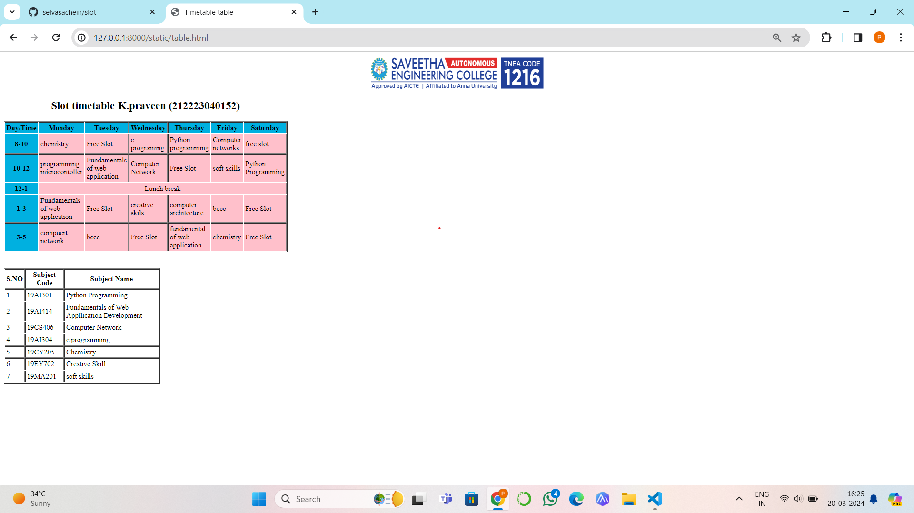

# Ex03 Time Table
<<<<<<< HEAD
## Date:13/03/2024
=======
## Date: 13.03.2024
>>>>>>> 0ea71382fad34302f8ca2fe6714e173540e9bdcd

## AIM
To write a html webpage page to display your slot timetable.

## ALGORITHM
### STEP 1
Create a Django-admin Interface.

### STEP 2
Create a static folder and inert HTML code.

### STEP 3
Create a simple table using ```<table>``` tag in html.

### STEP 4
Add header row using ```<th>``` tag.

### STEP 5
Add your timetable using ```<td>``` tag.

### STEP 6
Execute the program using runserver command.

## PROGRAM
```
<html>
<head>
<title>Timetable table</title>
</head>
<body>
<center></center>
<table border="1" cellspacing="2" cellpadding="3" height="6" width="300">
<caption><h2>Slot timetable-K.praveen (212223040152) </h2></caption>
<tr>
<th bgcolor="Sky blue">Day/Time</th>
<th bgcolor="Sky blue">Monday</th>
<th bgcolor="Sky blue">Tuesday</th>
<th bgcolor="Sky blue">Wednesday</th>
<th bgcolor="Sky blue">Thursday</th>
<th bgcolor="Sky blue">Friday</th>
<th bgcolor="Sky blue">Saturday</th>

</tr>
<tr>
<th bgcolor="Sky blue">8-10</th>
<td bgcolor="Pink" >chemistry</td>
<td bgcolor="Pink" >Free Slot</td>
<td bgcolor="Pink" >c programing</td>
<td bgcolor="Pink" >Python programming</td>
<td bgcolor="Pink" >Computer networks</td>
<td bgcolor="Pink" >free slot</td>
</tr>
<tr>
<th bgcolor="Sky blue">10-12</th>
<td bgcolor="Pink" >programming microcontoller</td>
<td bgcolor="Pink" >Fundamentals of web application</td>
<td bgcolor="Pink" >Computer Network</td>
<td bgcolor="Pink" >Free Slot</td>
<td bgcolor="Pink" >soft skills</td>
<td bgcolor="Pink" >Python Programming</td>
</tr>
<tr>
<th bgcolor="Sky blue">12-1</th>
<td bgcolor="Pink" colspan="6" align="center" >Lunch break</td>
</tr>
<tr>
<th bgcolor="Sky blue">1-3</th>
<td bgcolor="Pink" >Fundamentals of web application</td>
<td bgcolor="Pink" >Free Slot</td>
<td bgcolor="Pink" >creative skils</td>
<td bgcolor="Pink" >computer architecture</td>
<td bgcolor="Pink" >beee</td>
<td bgcolor="Pink" >Free Slot</td>
</tr>
<tr>
<th bgcolor="Sky blue">3-5</th>
<td bgcolor="Pink" >compuert network</td>
<td bgcolor="Pink" >beee</td>
<td bgcolor="Pink" >Free Slot</td>
<td bgcolor="Pink" >fundamental of web application</td>
<td bgcolor="Pink" >chemistry</td>
<td bgcolor="Pink" >Free Slot</td>
</tr>
</table>
<br>
<br>
<table border="2" cellspacing="2" cellpadding="3" width="350">
<caption></caption>
<tr>
<th>S.NO</th>
<th>Subject Code</th>
<th>Subject Name</th>
</tr>
<tr>
<td>1</td>
<td>19AI301</td>
<td>Python Programming</td>
</tr>
<tr>
<td>2</td>
<td>19AI414</td>
<td>Fundamentals of Web Appllication Development</td>
</tr>
<tr>
<td>3</td>
<td>19CS406</td>
<td>Computer Network</td>
</tr>
<tr>
<td>4</td>
<td>19AI304</td>
<td>c programming</td>
</tr>
<tr>
<td>5</td>
<td>19CY205</td>
<td>Chemistry</td>
</tr>
<tr>
<td>6</td>
<td>19EY702</td>
<td>Creative Skill</td>
</tr>
<tr>
<td>7</td>
<td>19MA201</td>
<td>soft skills</td>
<tr>
</body>
</html>
```
<<<<<<< HEAD
## OUTPUT

=======

## OUTPUT


>>>>>>> 0ea71382fad34302f8ca2fe6714e173540e9bdcd


## RESULT
The program for creating slot timetable using basic HTML tags is executed successfully.
